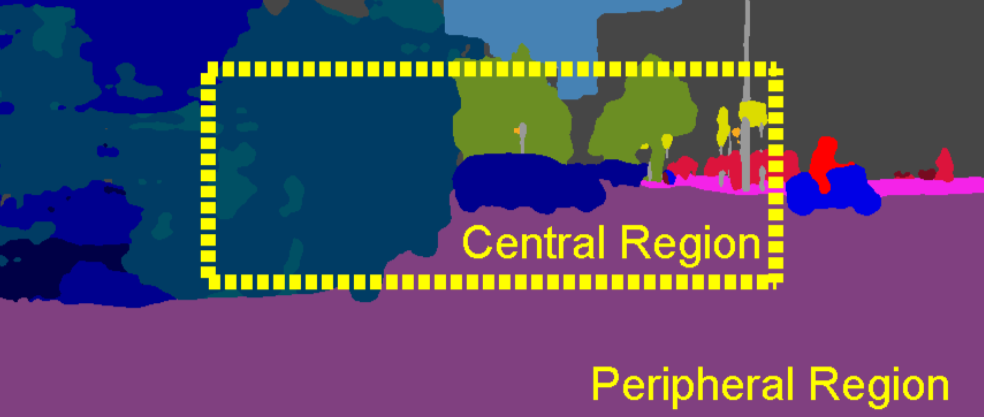
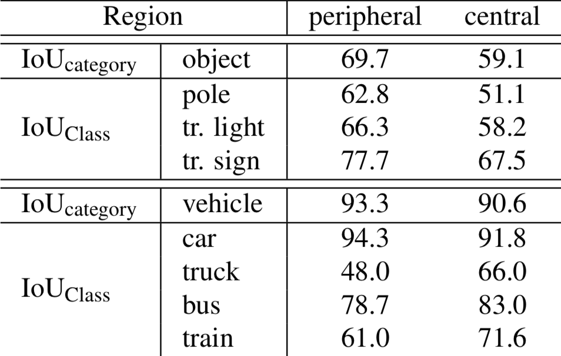
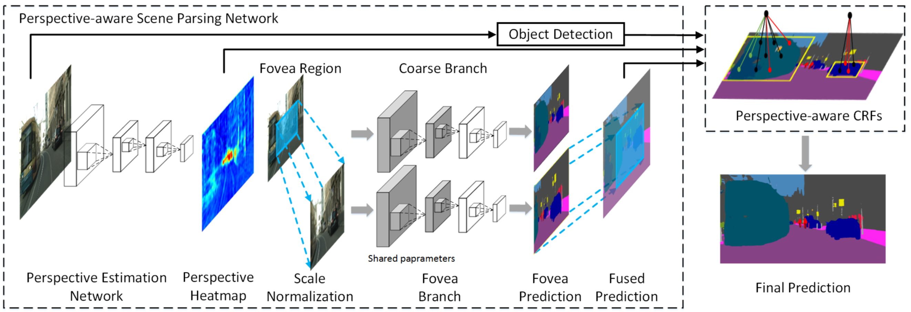
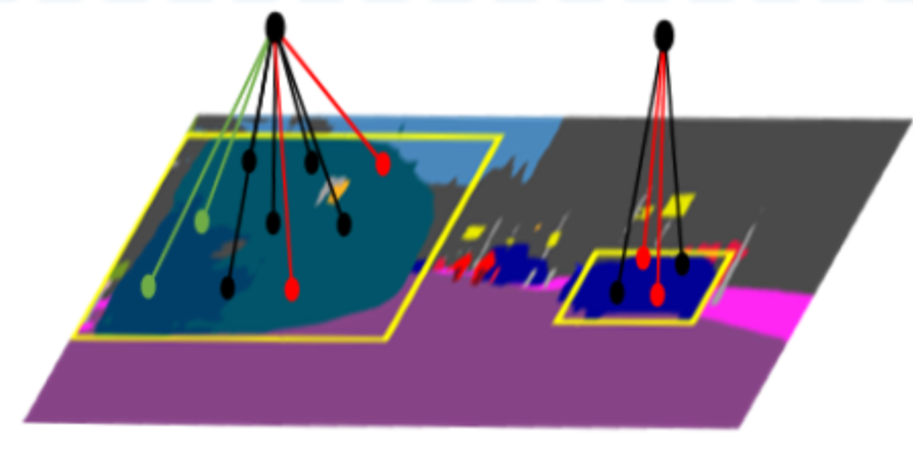
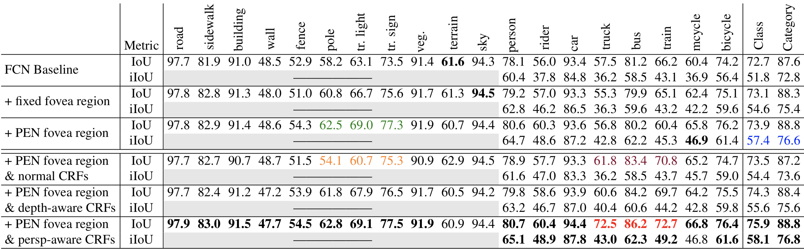
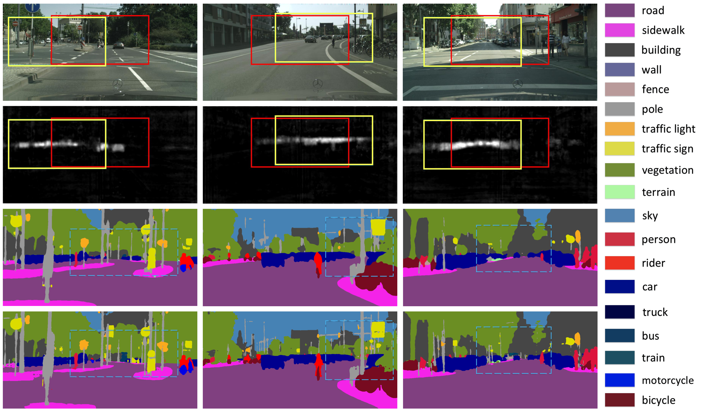
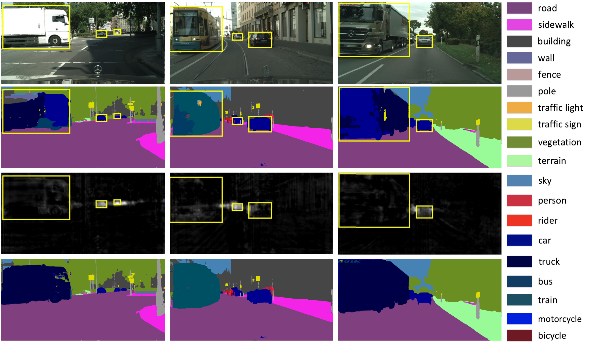
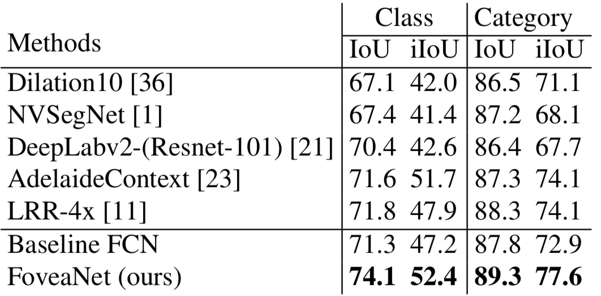
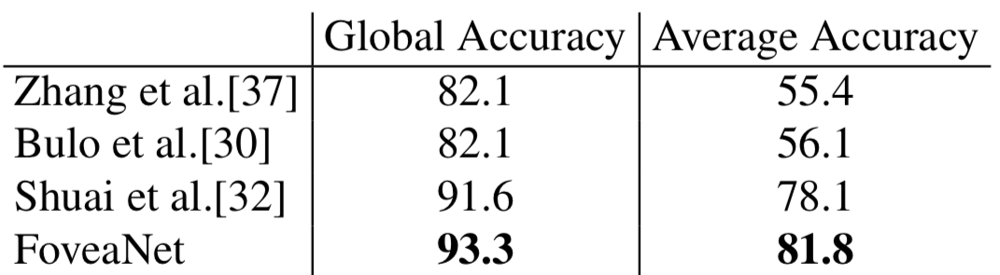

## FoveaNet: Perspective-aware Urban Scene Parsing
 Xin Li, Zequn Jie, Wei Wang, Changsong Liu, Jimei Yang, Xiaohui Shen, Zhe Lin, Qiang Chen, Shuicheng Yan, Jiashi Fen

---

## Self-Driving Car

---

# Problem

+++

+++

## Intuition

|||
| ---- | ---- |
| |  |

---

# Solution

*undo* Camara Perspective Projection by

**scale normalization**

---

# FoveaNet

FCN in FoveaNet: **ResNet-101**

---

### Perspective Estimation Network

+++

#### Training

$m$: object in the $n$-th image; $i$: pixel index;

$l(m)$: category label of instance $m$

`$$H_i^{(n)} = \frac{AveSize(l(m))}{Size(m)}$$`

`$$G_i = \frac{1}{N}\sum_{n=1}^N H_i^{(n)}$$`

`$$V_i^{(n)} = H_i^{(n)} + \delta \times G_i$$`

+++

#### Training Samples

---

### Perspective-aware Scene Parsing

ResNet-101 with shared parameters from `conv1` to `res3_3b3`.

---

### Perspective-aware CRFs

+++

`$$\mathcal{E}(l) = \sum_i \psi_u(l_i) + \sum_{i,j} \psi_{p,persp}(l_i, l_j)$$`

`$$\psi_{p,persp}(l_i, l_j) = \mu(p_i, p_j) \nu(l_i, l_j) \kappa(f_i, f_j)$$`

`$$\mu(p_i, p_j) = d_k(\frac{\sum_{m \in \hat{V}} \nu_m}{|\hat{V}|} / \frac{\sum_{n \in B_k} \nu_n}{|B_k|})$$`

---

# Results

Two datasets: **Cityscapes** & **Camvid**

+++

## Results

+++

+++

+++

## Results on Cityscapes

+++

## Results on Camvid

---

# The END
